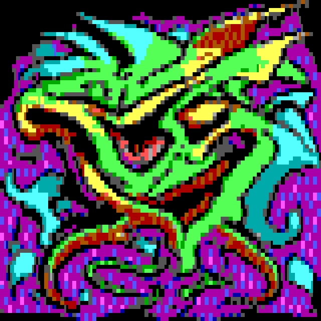
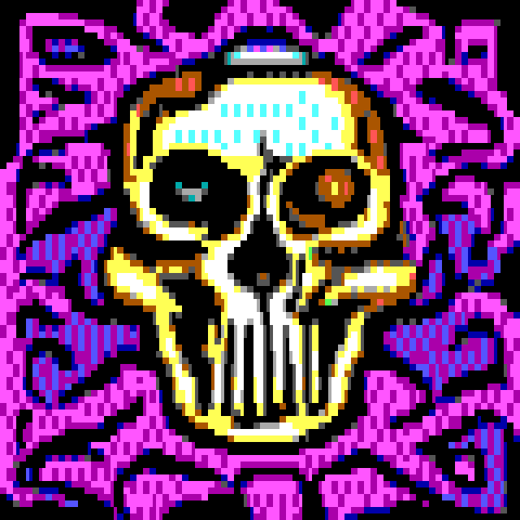
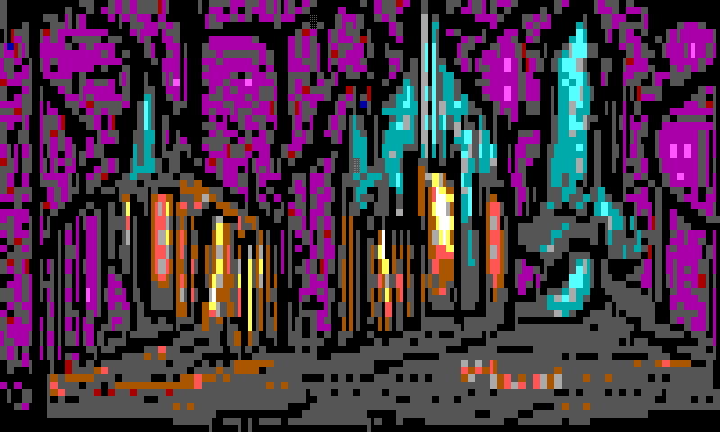
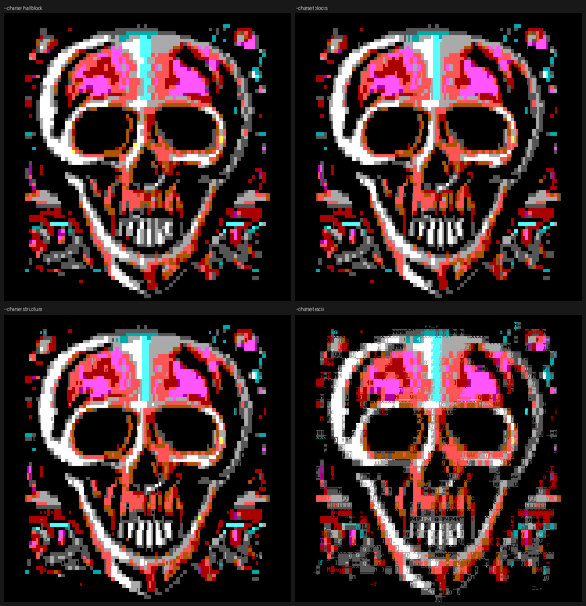

# ansimon — text-to-ANSI-art generator: real `.ANS` / `.XB`, rendered to PNG

Describe a picture, get ANSI art — with **one command**, entirely on your own
machines.

```bash
ansimon "a fierce dragon"                              # 80x40 -> PNG + .ans
ansimon "a castle at night" --size bbs --charset blocks
ansimon "a health potion" --cols 24 --rows 12 --xb     # game placeholder art
ansimon "a skull" -n 8 --fast --server rtx,titan,local # farm it
```

<p>
  
  
  
</p>

*(`ansimon "a fierce dragon"` · `"a skull"` · `"a wizard tower" --cols 100 --rows 30`)*

The output is a PNG, and **the PNG is a picture of a real ANSI file.** Every
pixel comes from a CP437 glyph bitmap filled with one of 16 ANSI colours. The
`.ans` (or `.xb`) that produced it is written alongside — open it in PabloDraw,
Moebius, or `cat` it in a terminal and you get the same image back. This is not
a "looks like ANSI" filter; the character grid is the actual intermediate.

Shares pixelmon's ComfyUI engine, render farm, and CLI conventions.

---

## What this is

A thin, friendly CLI (`ansimon`) over a local **ComfyUI** server, plus a custom
ComfyUI node (`ansi_quantize`) that turns the model's output into a true
character-cell grid. You type a prompt; you get a PNG and an art file. The
visual node-graph is handled behind the scenes.

**The single most important lesson** (and it differs from pixelmon's): *no
model anywhere is trained on `.ANS`.* The training data exists — 16colo.rs has
every artpack since 1990 — but nobody has used it since a 2016 char-RNN
experiment. So the work-split inverts:

| | pixelmon | ansimon |
|---|---|---|
| what the LoRA does | ~70% — real pixel art | gets you in the *neighbourhood* |
| what the node does | ~30% — palette lock | **the actual format**: cell grid, glyph choice, 16 colours |

The [ANSI Art Style XL LoRA](https://civitai.com/models/185538/ansi-art-xl)
biases SDXL toward flat regions, hard edges and a 4-bit look — exactly what
survives the trip down to 80 columns. Then `ansi_quantize` does the real work.

### It shares everything with pixelmon

| Shared | Not shared |
|---|---|
| `~/ComfyUI` + its venv + torch | the ANSI LoRA (327 MB) |
| `~/launch-comfyui.sh` (GPU autodetect) | the custom node (`ansi_quantize`) |
| the SDXL base + LCM LoRA | the workflow graph |
| port 8188, `servers.json`, the whole farm | |

Any box already running pixelmon becomes an ansimon box by running
`./install.sh` and `./download-models.sh`.

---

## Install

```bash
git clone <your-remote> ~/git/ansimon && cd ~/git/ansimon
./install.sh            # links files; reuses an existing ComfyUI if present
./download-models.sh    # 327 MB, the ANSI Art Style XL LoRA
# restart ComfyUI so it picks up the ansi_quantize node
ansimon "a fierce dragon"
```

If you don't have ComfyUI yet, `install.sh` will tell you to run pixelmon's
installer first — it builds exactly the engine ansimon needs.

Check everything with **`ansimon --doctor`**, which reports the font source,
glyph table health, whether the node is linked, and which farm boxes answer.

> **Civitai note.** Most Civitai downloads want an API token. `download-models.sh`
> tries without one and, if it gets a login page back, tells you exactly what to
> do rather than handing ComfyUI a 4 KB "safetensors". Set `CIVITAI_TOKEN=xxx`
> to make it unattended.

---

## Usage

Run `ansimon --help` for the full, colorized list. The essentials:

| Flag | What it does | Default |
|---|---|---|
| `--size WxH \| PRESET` | canvas **in characters** — `100x30`, or a preset | `80x40` |
| `--cols N` / `--rows N` | set either axis directly | — |
| `--charset NAME` | which CP437 characters may be used (`--list-charsets`) | `blocks` |
| `--palette NAME` | the 16 colours to render with (`--list-palettes`) | `ansi` |
| `--format FMT` | `ans` / `xb` / `both` / `none` | `ans` |
| `--style NAMES` | proven prompt guides, comma-separated (`--list-styles`) | — |
| `--dither` / `--no-dither` | cell-level error diffusion | on |
| `--ice` / `--no-ice` | iCE colours: 16 backgrounds, no blink | on |
| `-n, --number N` | how many to make, each a different seed | `1` |
| `--batch "a,b,c"` | round-robin subjects, each into its own folder | — |
| `--fast` | 8 steps via LCM: ~3× faster, rougher | off |
| `--seed N` | lock / repeat a result | random |
| `--aspect MODE` | `square`, or `classic` for the 4:3 CRT stretch | `square` |
| `--server NAME[,...]` | remote ComfyUI; comma-list = render farm | local |

The seed is in every filename, so to make a full-quality version of a fast
draft you liked, just re-run that seed:

```bash
ansimon "a laser turret" --fast        # prints e.g. seed=12345
ansimon "a laser turret" --seed 12345  # same turret, full quality
```

### Canvas sizes — any width you want

A cell is 8×16 pixels, so **cols:rows of 2:1 is a square image**. That is why
the default is 80×40 (→ 640×640), which matches a square SDXL render with no
stretching. Presets:

| Preset | Cells | Pixels | |
|---|---|---|---|
| `bbs` | 80×25 | 640×400 | the classic DOS text screen |
| `square` | 80×40 | 640×640 | default |
| `vga50` | 80×50 | 640×800 | VGA 50-line mode |
| `wide` | 132×43 | 1056×688 | 132-column text mode |

For game placeholder art, just say what you need — `--cols 24 --rows 12` gives
you a 192×192 tile. ansimon picks a latent resolution matching your canvas
aspect, so a wide canvas gets a wide render rather than a squashed square one.

> **Honest note on small tiles.** Under roughly 32 columns, expect to fight the
> model rather than the quantizer. The ANSI LoRA is trained on full BBS-screen
> compositions and will paint a whole scene into a 24×12 tile, so the subject
> ends up competing with background clutter. The quantizer reproduces that
> faithfully — which is the problem.
>
> What actually helps, in order: a **simpler prompt** (one noun, no setting),
> `--charset halfblock` so detail can't turn into speckle, and re-rolling seeds
> (`-n 8 --fast`) — composition varies a lot more than style does. `--black-bg`
> pins every background cell to black, which won't fix composition but does give
> you a keyable background for your engine. Style guides aimed at *scenes*
> (`blocktronics`, `demoscene`) make small tiles worse, not better.

### `--charset` — the vocabulary the matcher may use



| Name | Chars | What it's for |
|---|---|---|
| `halfblock` | 3 | space, █, ▀. Safest — always reads as real blockart |
| `blocks` | 9 | half blocks + the ░▒▓ shade ramp. **Default**, classic BBS |
| `geometric` | 10 | every block/shade/half plus ■ |
| `structure` | 50 | geometric + box drawing — lets the matcher find lines |
| `ascii` | 95 | printable 7-bit only. True ASCII art, colour via attributes |
| `full` | 254 | the whole code page. Most detail, most noise |

You can also pass raw hex: `--charset "0xDB,0xDF,0xB1"`.

### `--format` — and why you probably want `xb`

`.ANS` is a **stream**: escape codes replayed into a terminal. It has no width
field, so anything other than 80 columns depends on the viewer reading the
SAUCE record. ansimon warns you when you ask for a non-80-column `.ans`.

`.XB` ([XBin](http://www.acid.org/info/xbin/xbin.htm)) is a **file**: width and
height live in the header, so any canvas size is first-class. It also embeds:

* **the font** — ansimon *generates* its block and shade glyphs (see below), so
  embedding the 4 KB bitmap means the file renders identically anywhere, not
  just on machines with the right CP437 font;
* **the palette** — the 16 colours ship with the art, so the PNG and the file
  agree exactly.

It is also smaller: on a real 80×40 piece, 20.8 KB `.ans` → 8.3 KB compressed
`.xb` (RLE, ~78% of raw), and 4.2 KB without the embedded font.

> **A custom `--palette` does not survive in a plain `.ans`.** The file stores
> colour *indices*, and a viewer supplies its own RGB for index 9 — so
> `--palette GAMEBOY --format ans` yields art that looks right only in ansimon's
> own PNG. ansimon prints a note when you do this. The two ways a non-standard
> palette actually travels are `--format both` / `xb` (XBin embeds all 16) and
> `--truecolor --lock-palette` (literal RGB per cell).
>
> Note also that XBin's palette is **6-bit** per channel, so ansimon rounds the
> palette to what the file can hold before rendering. Colours can therefore sit
> up to 2/255 from the `.GPL` as written — invisible, and it keeps the PNG and
> the `.xb` in exact agreement. The canonical `ansi` and `EGA` palettes are
> unaffected; every channel in them is already DAC-exact.

Both formats carry a full **SAUCE** record (title / author / group / date, with
the correct DataType — 1/1 for ANSi, 6/0 for XBin):

```bash
ansimon "a rune" --format both --title "Rune" --author grymmjack --group ansimon
```

### `--depth` — 16, 256 or 24-bit colour

The 16 ANSI attributes are a hardware limit from 1981, and `.ANS` has quietly
outgrown them twice. Both extensions are `--depth` away:

```bash
ansimon "a neon city street at night"                    # 16 — the classic
ansimon "a neon city street at night" --depth 256        # xterm indexed
ansimon "a neon city street at night" --truecolor        # 24-bit RGB
```

Measured on one 80×40 render, same prompt and seed, mean per-channel distance
from the picture the model actually drew:

| depth | escape | colours | error | `.ans` |
|-------|--------|--------:|------:|-------:|
| `16`  | `ESC[1;36;44m` | 16 | 34.5 | 26.8 KB |
| `256` | `ESC[38;5;n;48;5;nm` | 224 | 17.1 | 59.3 KB |
| `rgb` | `ESC[1;r;g;bt` | 6082 | 6.6 | 122.4 KB |

The error roughly halves at each step, for about 2× the bytes.

**Why it gets better, and it isn't just "more colours".** At 16 colours the
matcher spends the glyph on *colour*: a shade character exists to fake a tone
that isn't in the palette. With the palette gone that job disappears, so the
glyph goes back to describing **shape** and the two colours come out exact.
That is why `--dither`, `--shading` and `--colors` are ignored at depth 256 and
`rgb` — all three exist to work around a 16-colour palette, and there isn't
one. ansimon tells you when it drops them.

**`--depth rgb` is the general case of the half-block trick.** With a charset
of just `▀`, the glyph covers the top half of the cell, so the foreground is
exactly the top pixel and the background exactly the bottom one — a lossless
image at `cols × 2·rows`, which is what
[IMG2ANS](https://github.com/grymmjack/img2ans) does. Allowing the full charset
lets a glyph edge follow a diagonal, which a half block cannot, so it can only
do better.

**Two dialects.** `--rgb-dialect pablo` (the default) writes
`ESC[1;r;g;bt` / `ESC[0;r;g;bt` — the PabloDraw / SyncTERM scene extension,
terminated with `t`, not the `m` you might expect. It is what PabloDraw and
IMG2ANS emit and what the scene reads. A 16-colour SGR attribute is written
underneath each one, exactly as PabloDraw's own files do, so anything that
ignores the extension still shows recognisable art instead of one flat colour.
`--rgb-dialect xterm` writes `ESC[38;2;r;g;bm` instead, which terminals prefer
and which is ~18% smaller (no fallback to carry).

> **Deep colour is `.ans` only.** XBin's attribute byte is four bits of
> foreground and four of background — there is no room for an index above 15,
> let alone 24 bits, and no extension slot to put one in. `--depth 256` or `rgb`
> with `--format xb` is refused rather than silently written wrong. If you want
> non-standard colours in a file **Moebius and PabloDraw can edit**, that is
> `--depth 16 --palette NAME --format xb`: XBin embeds all 16 exactly.

Two things worth knowing before you ship a deep-colour file:

* **256 is not a palette you choose.** `ESC[38;5;n` selects the *viewer's*
  table, so ansimon targets the xterm-256 standard. Indices 0–15 are the
  viewer's own 16 ANSI colours, and ansimon writes them in **SGR order**
  (1 = red, 4 = blue), not the VGA attribute order the rest of the codebase
  uses. Getting that backwards turns every red blue — see *Gotchas*.
* **A custom palette belongs at `rgb`, not `256`** — and needs
  `--lock-palette` to take effect. Without it, `rgb` is unconstrained and
  `--palette` only supplies the 16-colour SGR fallback.

#### `--lock-palette` — a non-EGA palette that actually survives

```bash
ansimon "a knight" --truecolor --lock-palette --palette ENDESGA-64
```

This is the one combination that gets an artist's own palette into a `.ANS`
intact. Every cell colour is snapped to the palette and then written as
**literal RGB**, so nothing depends on the viewer's colour table — unlike an
index, which means whatever the viewer decides it means.

It uses the palette's **full length**, not the 16-entry version: 18 of the 58
bundled palettes have more than 16 colours, up to `ATARI-8BIT` at 256 and `VGA`
at 255. Locked to the 64-colour `ENDESGA-64`, the same test image scores 26.2
error using 63 distinct colours — between plain 16 (34.5) and free `rgb` (6.6),
which is exactly what a deliberate palette restriction should cost.

`--lock-palette` is rgb-only and is refused elsewhere: at depth 16 the palette
already *is* the constraint, and at 256 the colours belong to the viewer.

### `--lora` — swapping the model's idea of "ANSI"

```bash
ansimon --list-loras                              # what's installed, and what each needs
ansimon "a knight" --lora teletext-screens-xl     # short name; no .safetensors needed
```

Two things `--list-loras` tells you that matter more than the file list:

**Which base each LoRA needs.** A LoRA only fits the architecture it was trained
against — SD1.5 cross-attention is 768 wide, SDXL's is 2048, and SDXL has a
second text encoder that SD1.5 LoRAs have no weights for. Mixing them doesn't
fail cleanly; it either dies deep in ComfyUI's weight patcher or samples a
picture that silently ignores the LoRA. ansimon reads both headers and refuses:

```
ansi-art-15.safetensors is a SD1.5 LoRA but --base sd_xl_base_1.0.safetensors is SDXL.
  Try: --base v1-5-pruned-emaonly
```

This is not hypothetical — the ANSI LoRAs on Civitai are split across SDXL,
SD1.5, Flux and ZImageTurbo, and the `grymmjack-*` LoRAs trained in this repo
are SD1.5 while `--base` defaults to SDXL.

**Which trigger word each one wants.** A LoRA fires properly only when the
prompt contains the token it was captioned with, and every ANSI LoRA picked a
different one — `ansiart`, `ral-ansrt`, `p1x3lt3xt`, `teletext page`. ansimon
used to hardcode `ansiart`, which is right for exactly one of them; comparing
LoRAs that way measures the base model with a stray token in the prompt.
`loras.json` maps them, `--trigger` overrides, and `--list-loras` shows a `?`
for any LoRA with no entry so you know it's falling back to the old default.

Drop a `.safetensors` in `ComfyUI/models/loras`, add an entry to `loras.json`,
done.

> One trigger is misspelled upstream (`zxspectrum syle`). It's kept verbatim,
> because the typo is the token the LoRA was actually trained on.

### `--from-ans` — read art ansimon didn't make

ansimon already owns a CP437 glyph table, a renderer, an XBin writer and a
terminal-accurate `.ANS` reader, so converting existing art is nearly free —
**no GPU, no model, no ComfyUI**:

```bash
ansimon --from-ans pack/            --output-to png/    # a folder of .ans -> PNG
ansimon --from-ans old.ans --format xb                  # lift .ANS into XBin
ansimon --from-ans art/ --palette xterm --rows 25       # re-palette, crop to a screen
```

The reader is a real terminal emulator, not a line-by-line parser, because it
has to be: in a corpus of 112 hand-drawn scene files, `ESC[#C` (cursor forward)
appeared in **111 of them, 8,336 times**. It's the standard space-saver — write
`ESC[40C` instead of forty spaces. Ignore cursor movement and the art collapses.
`ESC[#A` (cursor up) shows up too, meaning overdraw, so the canvas is
random-access and grows downward on demand — art is a fixed width but an
open-ended height (that corpus ran from 6 to 1000 rows).

Verified on all 112: every one parsed, and every resulting `.xb` renders
bit-identical to its PNG using only its own embedded font and palette.

### Train a LoRA on your own art

If you have a back catalogue of `.ans`, you can train a style LoRA on it and
generate in *your* style instead of a generic one. ansimon already supports
using it — `--lora` has been there all along — so the only new work is training:

```bash
./tools/train-lora.sh /path/to/your/ansi/src         # SDXL — the quality run
./tools/train-lora.sh /path/to/your/ansi/src --sd15  # SD 1.5 — the fast run
./tools/train-lora.sh /path/to/your/ansi/src --prep  # dataset only, train elsewhere

ansimon "grymmjack, a skull logo" --lora grymmjack.safetensors
```

**Run `--sd15` first.** SD1.5's UNet is 860M parameters against SDXL's 2.6B, so
on a 12 GB card it needs no memory tricks at all, takes a batch of 4, trains the
text encoder too, and finishes in a fraction of the time. Use it to find the
learning rate and epoch count — and to answer "is there enough signal in this
corpus?" — before committing to a long SDXL job. The resolutions fall out
perfectly either way: an 80x24 screen is **640x384 native for SD1.5** and
**1280x768 doubled for SDXL**, both /64-divisible, neither cropped nor resampled.

`tools/build-lora-dataset.py` does the conversion, and three choices in it are
load-bearing:

* **2× nearest-neighbour, never bicubic.** An 80-column canvas is 640 px wide
  and a 24-row screen is 384 px tall. Doubled that is **1280×768 — a native SDXL
  bucket**, so nothing is cropped, padded or resampled. Nearest because the whole
  lesson is hard block edges; bicubic would blur the one feature that matters.
* **Split tall pieces into screens.** Art files run to hundreds of rows. A BBS
  piece is composed screen by screen, so a 24-row slice is a real composition;
  a 1000-row scroll squashed into one sample is not.
* **Captions from SAUCE first.** About half of real art carries a human-written
  title (`"clockwork orange BBS menu template"`), which beats anything a vision
  model would invent about a picture made of blocks. The rest get a caption from
  a letters-to-blocks ratio, which cleanly separates a *logo* from a *menu*.

No horizontal-flip augmentation: half a typical corpus is lettering, and
mirroring it teaches backwards letterforms.

**GPU choice matters more than VRAM.** Ampere and later have real bf16 tensor
cores; Pascal doesn't. An 8 GB RTX 3070 beats a 12 GB Titan Xp here — same
reason pixelmon measured the Titan Xp *slower* than an RX 6600 at inference.
The config (`tools/lora/grymmjack-sdxl.toml`) is tuned for 8 GB: bf16, gradient
checkpointing, AdamW8bit, cached latents and text-encoder outputs, UNet only.

> Stop ComfyUI on the training box first — SDXL LoRA at 8 GB needs essentially
> all of it. The script warns you if something is already holding VRAM.

### Style guides (`--style`)

Editable prompt snippets in `styles.json` (`--list-styles`). The recurring
theme is *flat regions and hard edges*, because that is what survives 80
columns and 16 colours:

```bash
ansimon "a castle" --style highcontrast,silhouette
ansimon "SYSOP" --style logo,blocktronics
ansimon "a knight" --style fantasy,flat --black-bg
```

`flat`, `highcontrast`, `silhouette` and `duotone` are the workhorses;
`blocktronics`, `oldskool`, `bbs`, `fileid` and `demoscene` aim at particular
eras of the scene.

---

## How it works

```
prompt
  ├─ SDXL + ANSI Art Style XL LoRA @ latent matched to your canvas aspect
  ├─ grid alignment       recover the render's own block grid (ModeFilter)
  ├─ sample to cells      resize to exactly cols*8 x rows*16
  ├─ match each cell      pick (glyph, fg, bg) minimising squared error
  ├─ render               paint the cells back through the glyph bitmaps
  └─ PNG  +  .ans / .xb
```

### The cell matcher

For one cell we must choose a character and two colours. The key insight that
makes this tractable: **given a candidate glyph, the optimal colours are just
the mean of the pixels it covers (fg) and the mean of the pixels it doesn't
(bg)** — so we only ever search over ~9–254 characters, never over the 256
colour pairs. The squared error expands into a form built entirely from
per-(cell, glyph) sums, so every glyph for every cell is scored in two matrix
multiplies. 80×40 with the `structure` set takes well under a second.

Two things are carried over from pixelmon's `pixelart_palette`, because they
solve the same problems one step earlier:

* **`flatten_shrink()`** — the grid-aware downscale. The LoRA paints chunky
  blocks at 1024px, i.e. a much smaller *logical* image. A ModeFilter recovers
  that grid before reducing; sampling straight down to 80×40 gives you mush.
  `--snap-pixels` will instead use pixelmon's Rust pixel-snapper if you have it.
* **redmean colour distance** rather than RGB Euclidean. This matters far more
  at 16 colours than at 32 — a wrong pick is 1/16th of the entire gamut.

### Dithering

`--dither` (on by default) diffuses each cell's residual error to its
neighbours in serpentine order — Floyd–Steinberg at the cell level. It buys
back a lot of gradient, but undamped it *drifts*: residual accumulates across
all three channels until a near-grey cell tips into a saturated hue, which
shows up as coloured confetti in flat areas. `--dither-strength` (0.75) and an
internal clamp keep the gradient and drop the confetti. Turn it off for flatter,
blockier, more deliberately "drawn" output.

### The font problem

ansimon needs 8×16 bitmaps for all 256 CP437 characters — the quantizer uses
them as coverage masks, the renderer uses them to draw. Letters and box-drawing
come from a PSF console font (`/usr/share/consolefonts/*VGA16*`), mapped
CP437 → Unicode → glyph index via the font's own Unicode table.

But Debian's console fonts are **missing exactly the glyphs ANSI art is built
out of**:

```
0xB2 ▓ dark shade   0xDC ▄ lower half   0xDD ▌ left half
0xDE ▐ right half   0xDF ▀ upper half
```

Measured against a corpus of 112 hand-drawn scene pieces (179,000 non-blank
cells), **those five alone are 45.9% of all non-blank cells** — and 64.0%
together with █. So ansimon **generates the geometric range procedurally**, and
that isn't a fallback, it's the correct answer: a half block is not an
approximation of anything, it *is* the top 8 rows of the cell. The shade ramp is
ordered dither at exactly 25 / 50 / 75% coverage. This is also why embedding the
font in an `.xb` matters.

The same corpus says the default `--charset blocks` (9 characters) covers
**78.3%** of every non-blank cell those artists drew — going all the way up to
`structure` (50 characters) only reaches 80.8%. The long tail is mostly letters.

### Verification

The PNG is checked to be a *pixel-exact* rendering of the emitted art file:
parse the `.ans`/`.xb` back, re-render it, and compare. It matches to the byte,
including when the `.xb` is rendered using only its own embedded font and
palette. (The one deliberate difference: in `.ans`, a space character inherits
the current foreground colour rather than forcing a pointless attribute change
— fg is invisible on a blank cell, and it keeps files smaller.)

---

## Render farm

Any box running ComfyUI **with the `ansi_quantize` node installed** can be a
target. Pass a comma list and jobs fan out dynamically — faster boxes pull more
work, and results are fetched back over HTTP, no shared filesystem needed:

```bash
ansimon "a skull" -n 16 --server rtx,titan,local
```

```
🚜 render farm: 3 GPU(s) — 127.0.0.1:8188, 192.168.1.10:8188, 192.168.1.20:8188
⚠ dropping 192.168.1.10:8188: missing the ansi_quantize node
✅ [1/16] 127.0.0.1:8188  seed=900  ->  .../a_skull_..._ansi_00001_.png
```

A box that can't run the job is dropped **with the reason printed** — a
silently shrinking farm just looks like one slow GPU. The art file travels back
inline in the `/history` payload rather than as a second fetch, so a farm node
needs no shared mount.

Copy `servers.example.json` to `servers.json` and add your machines;
`install.sh` will reuse pixelmon's or soundmon's if you already have one.

---

## Gotchas

**Restart ComfyUI after installing.** Custom nodes are loaded at startup.
`ansimon --doctor` will tell you if the node isn't registered.

**One GPU, one job at a time.** ansimon queues on the same ComfyUI as pixelmon
and soundmon. On an 8 GB card, an ACE-Step song render (10 GB) followed by SDXL
will OOM the server — so a `ansimon` job queued behind a soundmon one can look
like a hang, and can take the server down with it. Check `~/ComfyUI/server.log`
and the queue if a job seems stuck.

**Re-quantizing is nearly free.** ComfyUI caches by node inputs, so changing
only `--charset` / `--palette` / `--dither` with the same `--seed` reuses the
sampled image: the first run is ~20 s, each variation after is ~1 s. Great for
exploring the look without re-rolling the picture.

**iCE colours.** On by default: 16 background colours and no blinking, which is
what the modern scene assumes. With `--no-ice` you get 8 backgrounds and bit 7
means blink. The matcher already prefers encoding a bright cell as `█` with a
bright *foreground* over a space with a bright *background*, because the former
works in every viewer ever made.

**`--fast` is genuinely rough.** 8 LCM steps at cfg 1.8. Use it to explore
seeds, then re-run the good one without `--fast`.

**Two colour orders, and mixing them up is the bug that keeps coming back.**
CGA/VGA attribute order runs the RGB bits the opposite way from ANSI's SGR
order, so index 1 is blue as an attribute and red in an escape code
(`CGA_TO_SGR = (0,4,2,6,1,5,3,7)`, its own inverse). It has now cost this
project twice: once as a straight fg/bg swap (38.8% of pixels wrong), and again
in `--depth 256`, where `ESC[38;5;n` counts in SGR order for n < 16 while the
palette table is in attribute order (2.72% wrong — small enough to look fine in
a screenshot). Anything that writes a colour *number* into a stream needs to
say which order it means. `tools/verify-depth.py` catches both.

**AMD gfx1032 needs `HSA_OVERRIDE_GFX_VERSION=10.3.0`.** ROCm ships no kernels
for that arch, so without the override ComfyUI dies with `HIP error: invalid
device function` partway into loading a LoRA. Export it before starting
ComfyUI, not in ansimon — it has to be in the server's environment.

---

## Layout

```
ansimon.py                          the CLI + render farm
bin/ansimon                         wrapper: starts ComfyUI if needed
styles.json                         prompt style guides
servers.example.json                copy to servers.json, add your boxes
custom_nodes/ansi_quantize/
    nodes.py                        AnsiQuantize + SaveAnsi
    cp437.py                        the 256-glyph 8x16 bitmap table
    ansi.py                         .ANS writer/reader + SAUCE + cell transport
    xbin.py                         .XB writer/reader + RLE + embedded font
    palette.py                      the 16 ANSI colours, .GPL loading
```

---

## Credits

* [ANSI Art Style XL](https://civitai.com/models/185538/ansi-art-xl) by hj — the LoRA
* [ComfyUI](https://github.com/comfyanonymous/ComfyUI) — the engine
* [16colo.rs](https://16colo.rs/) — the archive that should train the next one
* [XBin spec](http://www.acid.org/info/xbin/xbin.htm) and SAUCE by Tasmaniac / ACiD

MIT. See LICENSE.
